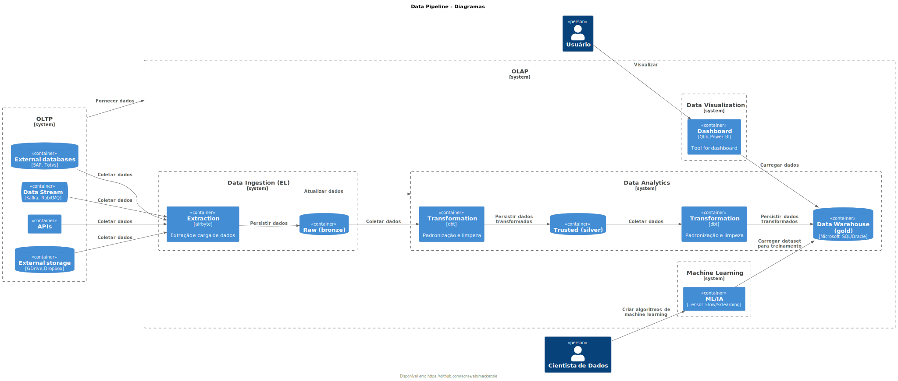

# Mackenzie

MBA em DevOps Engineering and Cloud Solutions

## Data Pipeline




- https://aws.amazon.com/pt/compare/the-difference-between-etl-and-elt/

## Pessoas

###  [Apresentações](docs/apresentacao.md)

## DBRE (Database Reliability Engineer) e DataOps

### Conteúdo Programático

* DBRE e DataOps
* Gestão e Governança de Dados
* LGPD
* Arquitetura de Dados Relacionais
* Arquitetura NoSQL
* Soluções de Armazenamento de Dados na Nuvem
* Controle de versão em banco de dados com migrations

### Metodologia

- Contexto
- Perguntas/Dúvidas/Desafios
- Soluções
- Implementação da solução

### Install PlantUML Ubuntu/Code Space

```sh
pip3 install pydot graphviz
```

## Anotações de aula

- [Data Ingestion/Airbyte: Site Oficial](https://airbyte.com/)
- [Data Ingestion/Airbyte: Install](https://github.com/acnaweb/airbyte)
- [Data Transformation/dbt Adapters: truested](https://docs.getdbt.com/docs/trusted-adapters)
- [Data Transformation/dbt Adapters: community](https://docs.getdbt.com/docs/community-adapters)
- [Data Transformation/SQL CTE](https://www.atlassian.com/data/sql/using-common-table-expressions)
- [Data Product: Data Contract](https://datacontract.com/)
- [Databases: Containers](https://github.com/acnaweb/database)
- [Test Container](https://testcontainers.com/)
- [Python: Install](https://www.python.org/downloads/)
- [Python: Repo template](https://github.com/acnaweb/python)
- [Pypi: repositório de artefatos Python](https://pypi.org/)
- [The 2024 MAD (ML, AI & Data) Landscape](https://mad.firstmark.com/)
- [Gitignore.io](https://www.toptal.com/developers/gitignore/)
- [Pre-commit](https://pre-commit.com/)
- [Makefile in Windows](https://medium.com/@samsorrahman/how-to-run-a-makefile-in-windows-b4d115d7c516)
- [Jinja: Template Engine](https://jinja.palletsprojects.com/en/3.1.x/)
- https://docs.getdbt.com/docs/build/custom-schemas
- https://www.databricks.com/glossary/medallion-architecture
- https://rivery.io/data-learning-center/types-of-etl-data-transformation/
- https://github.com/plantuml-stdlib/C4-PlantUML
- https://c4model.com/
- https://dataengineering.wiki/Index
- https://learn.microsoft.com/pt-br/power-bi/guidance/star-schema
- https://www.kimballgroup.com/data-warehouse-business-intelligence-resources/books/data-warehouse-dw-toolkit/


